# Browser-Use Framework

## Overview

The Browser-Use framework is a comprehensive system that enables AI agents to perceive, reason about, and interact with web interfaces through a sophisticated multi-layered architecture. The framework bridges the gap between large language models (LLMs) and web browsers, providing a robust abstraction that handles the complexity of web automation while exposing a clean, consistent interface for AI-driven web tasks.

At its core, the framework implements a perception-action cycle where AI agents observe web pages through structured DOM representations, reason about content and structure, plan interactions based on task objectives, and execute precise browser automation commands—all while maintaining a stateful understanding that persists across page transitions and application states.

## Architecture

The Browser-Use framework is organized into four hierarchical layers, each providing specific functionality while abstracting underlying complexity:

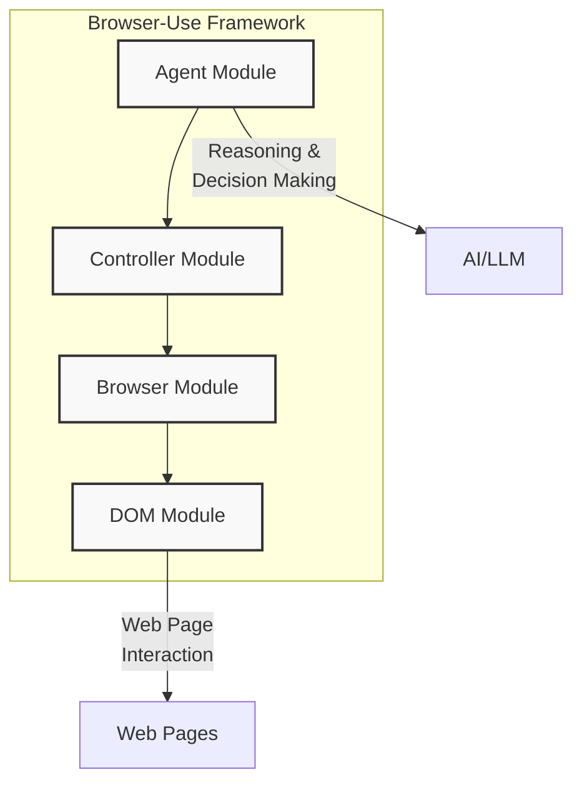

### 1. DOM Module (Perception Layer)

The foundation layer that extracts, processes, and represents web page structure and content. It transforms the complex hierarchical structure of web pages into a semantically rich, AI-interpretable representation.

### 2. Browser Module (Interface Layer)

The abstraction layer that encapsulates web browser complexities while providing a consistent interface for programmatic web interaction. It manages browser instances, contexts, pages, and synchronization with dynamic content.

### 3. Controller Module (Translation Layer)

The command and control layer that translates abstract agent intentions into concrete browser actions through a structured action registry and execution pipeline. It handles validation, error recovery, and feedback.

### 4. Agent Module (Cognitive Layer)

The orchestration layer that connects LLMs with web browsing capabilities. It handles state representation, reasoning, planning, and action generation while maintaining contextual awareness across interactions.

## Component Workflow

The following diagram illustrates the typical workflow between components:

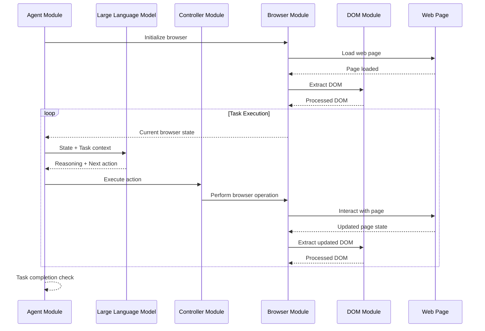

## Key Features

- **Bidirectional State Translation**: Maps between browser DOM states and LLM-interpretable formats
- **Intelligent DOM Processing**: Extracts, filters, and optimizes web page structure
- **Context-Aware Memory**: Maintains coherent task execution despite limited LLM context windows
- **Action Registry System**: Extensible command pattern for browser interactions
- **Error Recovery Strategies**: Robust handling of unexpected states and failures
- **Visibility-Aware Perception**: Prioritizes user-visible and interactive content
- **Token Optimization**: Balances information completeness with LLM token efficiency

## Module Details

### DOM Module

The perceptual foundation that implements DOM extraction, processing, and representation:

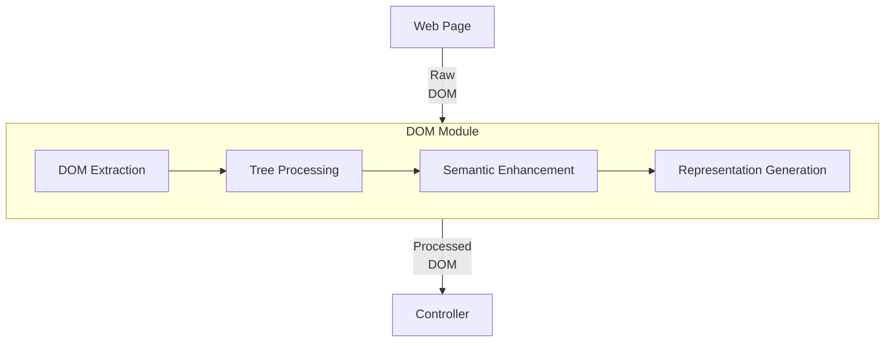

**Key Components:**
- JavaScript DOM extraction engine
- Python DOM processing service
- Tree optimization algorithms
- Visibility detection
- Token-efficient serialization

### Browser Module

The foundational abstraction layer for browser automation:

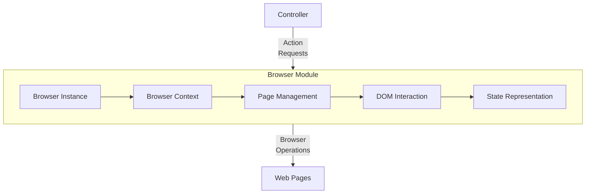

**Key Components:**
- Playwright integration
- Context and session management
- Navigation and URL handling
- Page interaction primitives
- Screenshot and state capture

### Controller Module

The command and control layer for browser actions:

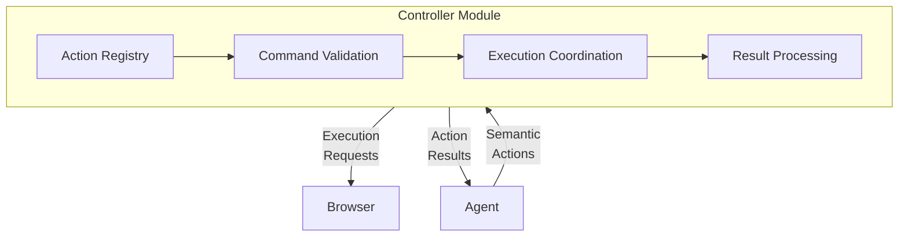

**Key Components:**
- Extensible action registry
- Parameter validation
- Error handling framework
- Stateful execution context
- Result processing and feedback

### Agent Module

The cognitive core that orchestrates the AI-driven browsing:

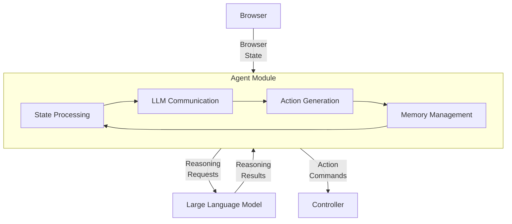

**Key Components:**
- LLM integration
- Message management
- Token optimization
- State representation
- Action planning and execution

## Data Flow

The following diagram illustrates the data flow through the system:

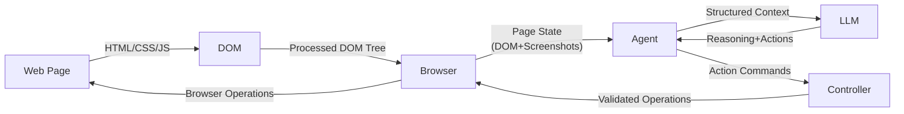

## Usage

The Browser-Use framework is designed to be used as follows:

```python
from browser_use import Agent
from langchain_openai import ChatOpenAI

# Create an agent with a specific task
agent = Agent(
    task="Search for information about AI and summarize the results",
    llm=ChatOpenAI(model="gpt-4o"),
)

# Run the agent to complete the task
result = await agent.run()
print(result)
```

## Extension Points

The framework is designed for extensibility at each layer:

- **DOM Module**: Custom element filters, semantic annotations, specialized extractors
- **Browser Module**: Custom browser configurations, interaction strategies, selector mechanisms
- **Controller Module**: Custom actions, validation rules, error handling strategies
- **Agent Module**: Alternative LLM providers, custom prompts, domain-specific optimizations

## Conclusion

The Browser-Use framework provides a comprehensive solution for AI-driven web automation, enabling language models to perceive, reason about, and interact with web interfaces through a sophisticated multi-layered architecture. By bridging the gap between high-level AI reasoning and low-level browser automation, the framework opens new possibilities for intelligent web agents that can perform complex tasks involving navigation, form filling, content analysis, and decision-making—all while maintaining a coherent understanding of ongoing tasks across multiple page transitions and application states.

<picture>
  <source media="(prefers-color-scheme: dark)" srcset="./static/browser-use-dark.png">
  <source media="(prefers-color-scheme: light)" srcset="./static/browser-use.png">
  
</picture>

<h1 align="center">Enable AI to control your browser 🤖</h1>

[](https://github.com/gregpr07/browser-use/stargazers)
[](https://link.browser-use.com/discord)
[](https://docs.browser-use.com)
[](https://cloud.browser-use.com)
[](https://x.com/gregpr07)
[](https://x.com/mamagnus00)
[](https://app.workweave.ai/reports/repository/org_T5Pvn3UBswTHIsN1dWS3voPg/881458615)


🌐 Browser-use is the easiest way to connect your AI agents with the browser. 

💡 See what others are building and share your projects in our [Discord](https://link.browser-use.com/discord) - we'd love to see what you create!

🌩️ Skip the setup - try our hosted version for instant browser automation! [Try it now](https://cloud.browser-use.com).


# Quick start


With pip (Python>=3.11):

```bash
pip install browser-use
```

install playwright:

```bash
playwright install
```

Spin up your agent:

```python
from langchain_openai import ChatOpenAI
from browser_use import Agent
import asyncio
from dotenv import load_dotenv
load_dotenv()

async def main():
    agent = Agent(
        task="Go to Reddit, search for 'browser-use', click on the first post and return the first comment.",
        llm=ChatOpenAI(model="gpt-4o"),
    )
    result = await agent.run()
    print(result)

asyncio.run(main())
```

Add your API keys for the provider you want to use to your `.env` file.

```bash
OPENAI_API_KEY=
```

For other settings, models, and more, check out the [documentation 📕](https://docs.browser-use.com).


### Test with UI

You can test [browser-use with a UI repository](https://github.com/browser-use/web-ui)

Or simply run the gradio example:

```
uv pip install gradio
```

```bash
python examples/ui/gradio_demo.py
```

# Demos


<br/><br/>

[Task](https://github.com/browser-use/browser-use/blob/main/examples/use-cases/shopping.py): Add grocery items to cart, and checkout.

[](https://www.youtube.com/watch?v=L2Ya9PYNns8)


<br/><br/>


Prompt: Add my latest LinkedIn follower to my leads in Salesforce.


<br/><br/>

[Prompt](https://github.com/browser-use/browser-use/blob/main/examples/use-cases/find_and_apply_to_jobs.py): Read my CV & find ML jobs, save them to a file, and then start applying for them in new tabs, if you need help, ask me.'

https://github.com/user-attachments/assets/171fb4d6-0355-46f2-863e-edb04a828d04

<br/><br/>

[Prompt](https://github.com/browser-use/browser-use/blob/main/examples/browser/real_browser.py): Write a letter in Google Docs to my Papa, thanking him for everything, and save the document as a PDF.


<br/><br/>

[Prompt](https://github.com/browser-use/browser-use/blob/main/examples/custom-functions/save_to_file_hugging_face.py): Look up models with a license of cc-by-sa-4.0 and sort by most likes on Hugging face, save top 5 to file.

https://github.com/user-attachments/assets/de73ee39-432c-4b97-b4e8-939fd7f323b3


<br/><br/>


## More examples

For more examples see the [examples](examples) folder or join the [Discord](https://link.browser-use.com/discord) and show off your project.

# Vision

Tell your computer what to do, and it gets it done.

## Roadmap

### Agent
- [ ] Improve agent memory (summarize, compress, RAG, etc.)
- [ ] Enhance planning capabilities (load website specific context)
- [ ] Reduce token consumption (system prompt, DOM state)

### DOM Extraction
- [ ] Improve extraction for datepickers, dropdowns, special elements
- [ ] Improve state representation for UI elements

### Rerunning tasks
- [ ] LLM as fallback
- [ ] Make it easy to define workfows templates where LLM fills in the details
- [ ] Return playwright script from the agent

### Datasets
- [ ] Create datasets for complex tasks
- [ ] Benchmark various models against each other
- [ ] Fine-tuning models for specific tasks

### User Experience
- [ ] Human-in-the-loop execution
- [ ] Improve the generated GIF quality
- [ ] Create various demos for tutorial execution, job application, QA testing, social media, etc.

## Contributing

We love contributions! Feel free to open issues for bugs or feature requests. To contribute to the docs, check out the `/docs` folder.

## Local Setup

To learn more about the library, check out the [local setup 📕](https://docs.browser-use.com/development/local-setup).

## Cooperations

We are forming a commission to define best practices for UI/UX design for browser agents.
Together, we're exploring how software redesign improves the performance of AI agents and gives these companies a competitive advantage by designing their existing software to be at the forefront of the agent age.

Email [Toby](mailto:tbiddle@loop11.com?subject=I%20want%20to%20join%20the%20UI/UX%20commission%20for%20AI%20agents&body=Hi%20Toby%2C%0A%0AI%20found%20you%20in%20the%20browser-use%20GitHub%20README.%0A%0A) to apply for a seat on the committee.
## Citation

If you use Browser Use in your research or project, please cite:


    
```bibtex
@software{browser_use2024,
  author = {Müller, Magnus and Žunič, Gregor},
  title = {Browser Use: Enable AI to control your browser},
  year = {2024},
  publisher = {GitHub},
  url = {https://github.com/browser-use/browser-use}
}
```
 


 <div align="center">  
 
[](https://x.com/gregpr07)
[](https://x.com/mamagnus00)
 
 </div> 

<div align="center">
Made with ❤️ in Zurich and San Francisco
 </div> 

---

# Browser-Use Framework (中文版)

## 概述

Browser-Use 框架是一个全面的系统，通过复杂的多层架构使 AI 代理能够感知、推理并与网页界面交互。该框架弥合了大型语言模型 (LLM) 与网页浏览器之间的差距，提供了一个强大的抽象层来处理网页自动化的复杂性，同时为 AI 驱动的网页任务提供清晰一致的接口。

在其核心，该框架实现了一个感知-行动循环，AI 代理通过结构化的 DOM 表示观察网页，对内容和结构进行推理，基于任务目标规划交互，并执行精确的浏览器自动化命令——同时保持在页面转换和应用程序状态之间持续的状态理解。

## 架构

Browser-Use 框架组织为四个层次层，每层提供特定功能，同时抽象底层复杂性：

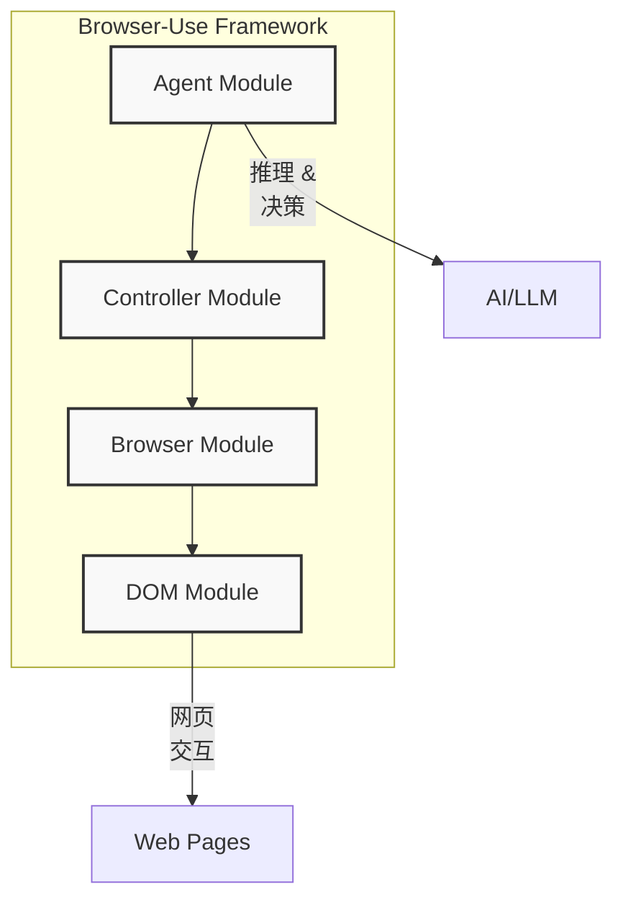

### 1. DOM 模块（感知层）

基础层，提取、处理和表示网页结构和内容。它将网页的复杂层次结构转换为语义丰富、AI 可解释的表示。

### 2. Browser 模块（接口层）

抽象层，封装网页浏览器的复杂性，同时为程序化网页交互提供一致的接口。它管理浏览器实例、上下文、页面，并与动态内容同步。

### 3. Controller 模块（转换层）

命令和控制层，通过结构化的操作注册表和执行流水线将抽象代理意图转换为具体浏览器操作。它处理验证、错误恢复和反馈。

### 4. Agent 模块（认知层）

协调层，连接 LLM 与网页浏览功能。它处理状态表示、推理、规划和操作生成，同时在交互过程中保持上下文感知。

## 组件工作流

以下图表说明了组件之间的典型工作流：

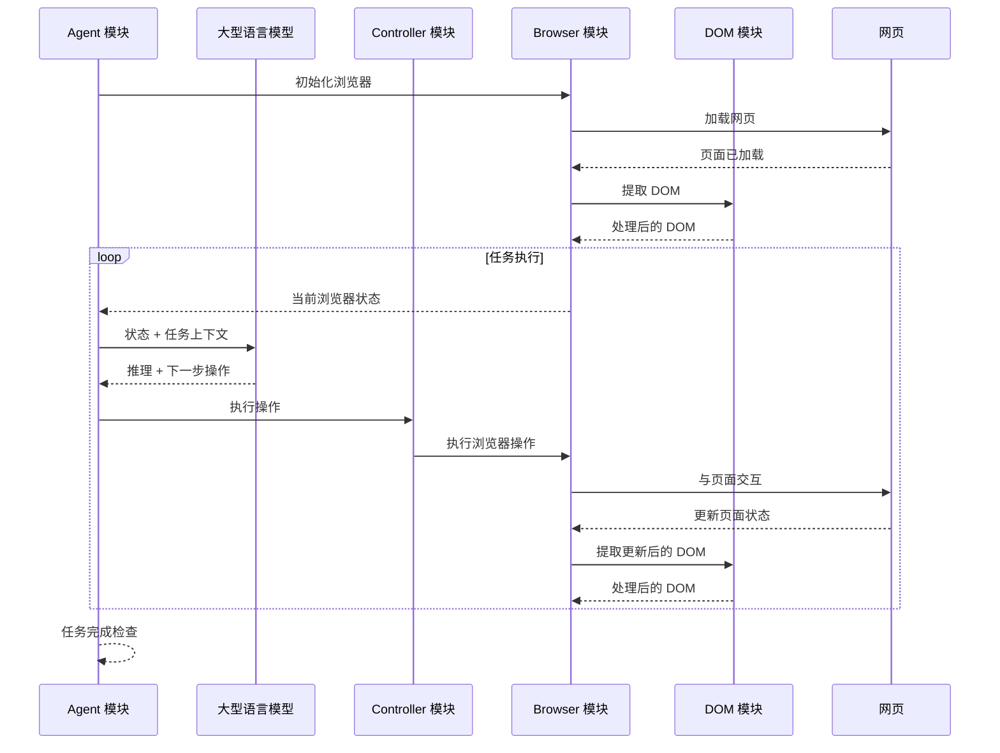

## 关键特性

- **双向状态转换**：在浏览器 DOM 状态和 LLM 可解释格式之间建立映射
- **智能 DOM 处理**：提取、过滤和优化网页结构
- **上下文感知内存**：尽管 LLM 上下文窗口有限，仍保持连贯的任务执行
- **操作注册系统**：浏览器交互的可扩展命令模式
- **错误恢复策略**：对意外状态和失败的强大处理
- **可见性感知**：优先处理用户可见和交互内容
- **令牌优化**：平衡信息完整性与 LLM 令牌效率

## 模块详情

### DOM 模块

实现 DOM 提取、处理和表示的感知基础：

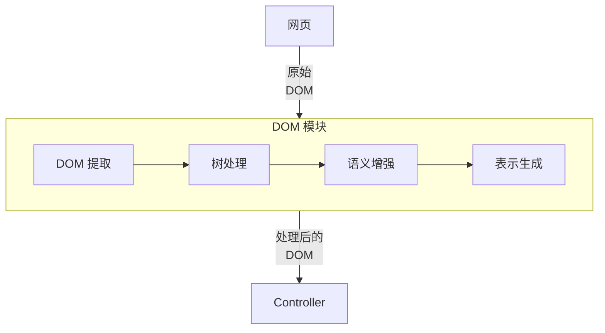

**关键组件：**
- JavaScript DOM 提取引擎
- Python DOM 处理服务
- 树优化算法
- 可见性检测
- 令牌高效序列化

### Browser 模块

浏览器自动化的基础抽象层：

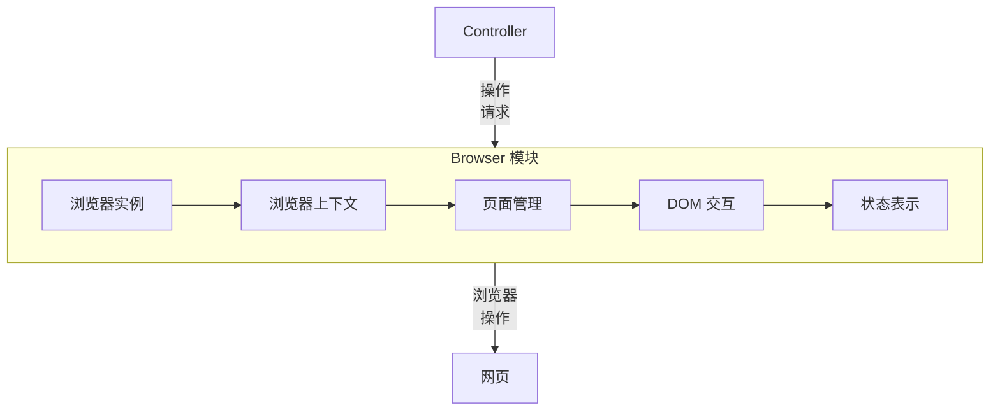

**关键组件：**
- Playwright 集成
- 上下文和会话管理
- 导航和 URL 处理
- 页面交互原语
- 截图和状态捕获

### Controller 模块

浏览器操作的命令和控制层：

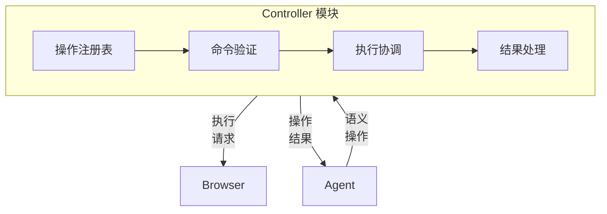

**关键组件：**
- 可扩展操作注册表
- 参数验证
- 错误处理框架
- 有状态执行上下文
- 结果处理和反馈

### Agent 模块

协调 AI 驱动浏览的认知核心：

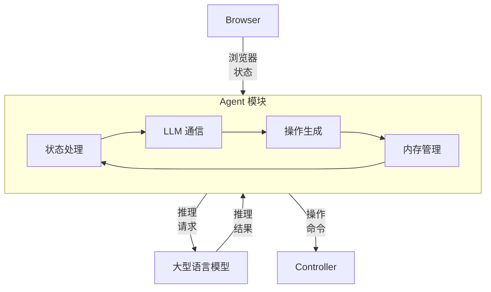

**关键组件：**
- LLM 集成
- 消息管理
- 令牌优化
- 状态表示
- 操作规划和执行

## 数据流

以下图表说明了系统中的数据流：

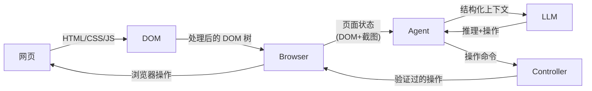

## 使用方法

Browser-Use 框架的设计使用方式如下：

```python
from browser_use import Agent
from langchain_openai import ChatOpenAI

# 创建一个具有特定任务的代理
agent = Agent(
    task="搜索关于人工智能的信息并总结结果",
    llm=ChatOpenAI(model="gpt-4o"),
)

# 运行代理完成任务
result = await agent.run()
print(result)
```

## 扩展点

该框架设计为在每一层都可扩展：

- **DOM 模块**：自定义元素过滤器、语义注释、专门的提取器
- **Browser 模块**：自定义浏览器配置、交互策略、选择器机制
- **Controller 模块**：自定义操作、验证规则、错误处理策略
- **Agent 模块**：替代 LLM 提供商、自定义提示、特定领域优化

## 结论

Browser-Use 框架为 AI 驱动的网页自动化提供了全面的解决方案，通过复杂的多层架构使语言模型能够感知、推理并与网页界面交互。通过弥合高级 AI 推理与低级浏览器自动化之间的差距，该框架为能够执行涉及导航、表单填写、内容分析和决策的复杂任务的智能网页代理打开了新的可能性——同时在多个页面转换和应用程序状态之间保持对持续任务的连贯理解。

<picture>
  <source media="(prefers-color-scheme: dark)" srcset="./static/browser-use-dark.png">
  <source media="(prefers-color-scheme: light)" srcset="./static/browser-use.png">
  
</picture>

<h1 align="center">使 AI 控制您的浏览器 🤖</h1>

[](https://github.com/gregpr07/browser-use/stargazers)
[](https://link.browser-use.com/discord)
[](https://docs.browser-use.com)
[](https://cloud.browser-use.com)
[](https://x.com/gregpr07)
[](https://x.com/mamagnus00)
[](https://app.workweave.ai/reports/repository/org_T5Pvn3UBswTHIsN1dWS3voPg/881458615)


🌐 Browser-use 是连接 AI 代理与浏览器的最简单方式。

💡 在我们的 [Discord](https://link.browser-use.com/discord) 中查看其他人的项目并分享您的项目 - 我们很想看到您的创作！

🌩️ 跳过设置 - 尝试我们的托管版本，即时实现浏览器自动化！[立即尝试](https://cloud.browser-use.com)。


# 快速开始


使用 pip (Python>=3.11)：

```bash
pip install browser-use
```

安装 playwright：

```bash
playwright install
```

启动您的代理：

```python
from langchain_openai import ChatOpenAI
from browser_use import Agent
import asyncio
from dotenv import load_dotenv
load_dotenv()

async def main():
    agent = Agent(
        task="前往 Reddit，搜索 'browser-use'，点击第一个帖子并返回第一条评论。",
        llm=ChatOpenAI(model="gpt-4o"),
    )
    result = await agent.run()
    print(result)

asyncio.run(main())
```

将您想使用的提供商的 API 密钥添加到您的 `.env` 文件中。

```bash
OPENAI_API_KEY=
```

有关其他设置、模型等更多信息，请查看[文档 📕](https://docs.browser-use.com)。


### 使用 UI 测试

您可以使用 [browser-use with a UI repository](https://github.com/browser-use/web-ui) 进行测试

或者简单地运行 gradio 示例：

```
uv pip install gradio
```

```bash
python examples/ui/gradio_demo.py
```

# 演示案例

<br/><br/>

[任务](https://github.com/browser-use/browser-use/blob/main/examples/use-cases/shopping.py)：将杂货项目添加到购物车，并结账。

[](https://www.youtube.com/watch?v=L2Ya9PYNns8)


<br/><br/>


提示：将我最新的 LinkedIn 关注者添加到我在 Salesforce 中的潜在客户。


<br/><br/>

[提示](https://github.com/browser-use/browser-use/blob/main/examples/use-cases/find_and_apply_to_jobs.py)：阅读我的简历并找到机器学习相关工作，将它们保存到文件中，然后在新标签页中开始申请，如果需要帮助，请告诉我。

https://github.com/user-attachments/assets/171fb4d6-0355-46f2-863e-edb04a828d04

<br/><br/>

[提示](https://github.com/browser-use/browser-use/blob/main/examples/browser/real_browser.py)：在 Google 文档中写一封信给我的爸爸，感谢他所做的一切，并将文档保存为 PDF。


<br/><br/>

[提示](https://github.com/browser-use/browser-use/blob/main/examples/custom-functions/save_to_file_hugging_face.py)：在 Hugging Face 上查找许可证为 cc-by-sa-4.0 的模型并按最喜欢排序，将前 5 个保存到文件。

https://github.com/user-attachments/assets/de73ee39-432c-4b97-b4e8-939fd7f323b3


<br/><br/>


## 更多示例

有关更多示例，请查看 [examples](examples) 文件夹或加入 [Discord](https://link.browser-use.com/discord) 展示您的项目。

# 愿景

告诉您的计算机要做什么，它就会完成。

## 路线图

### Agent
- [ ] 改进代理内存（摘要、压缩、RAG 等）
- [ ] 增强规划能力（加载网站特定上下文）
- [ ] 减少令牌消耗（系统提示、DOM 状态）

### DOM 提取
- [ ] 改进日期选择器、下拉列表、特殊元素的提取
- [ ] 改进 UI 元素的状态表示

### 重新运行任务
- [ ] LLM 作为后备
- [ ] 使定义 LLM 填充细节的工作流模板变得简单
- [ ] 从代理返回 playwright 脚本

### 数据集
- [ ] 创建复杂任务的数据集
- [ ] 对各种模型进行基准测试
- [ ] 针对特定任务微调模型

### 用户体验
- [ ] 人机协作执行
- [ ] 改进生成的 GIF 质量
- [ ] 为教程执行、工作申请、QA 测试、社交媒体等创建各种演示

## 贡献

我们欢迎贡献！请随时为 bug 或功能请求开设 issue。要为文档做贡献，请查看 `/docs` 文件夹。

## 本地设置

要了解有关库的更多信息，请查看[本地设置 📕](https://docs.browser-use.com/development/local-setup)。

## 合作

我们正在组建一个委员会，为浏览器代理定义 UI/UX 设计的最佳实践。
我们共同探索软件重新设计如何提高 AI 代理的性能，并通过设计现有软件使这些公司在代理时代处于领先地位，从而获得竞争优势。

发送邮件给 [Toby](mailto:tbiddle@loop11.com?subject=I%20want%20to%20join%20the%20UI/UX%20commission%20for%20AI%20agents&body=Hi%20Toby%2C%0A%0AI%20found%20you%20in%20the%20browser-use%20GitHub%20README.%0A%0A) 申请委员会席位。

## 引用

如果您在研究或项目中使用 Browser Use，请引用：
    
```bibtex
@software{browser_use2024,
  author = {Müller, Magnus and Žunič, Gregor},
  title = {Browser Use: Enable AI to control your browser},
  year = {2024},
  publisher = {GitHub},
  url = {https://github.com/browser-use/browser-use}
}
```

 <div align="center">  
 
[](https://x.com/gregpr07)
[](https://x.com/mamagnus00)
 
 </div> 

<div align="center">
在苏黎世和旧金山用 ❤️ 制作
</div> 


