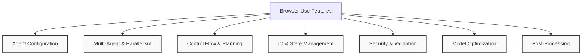
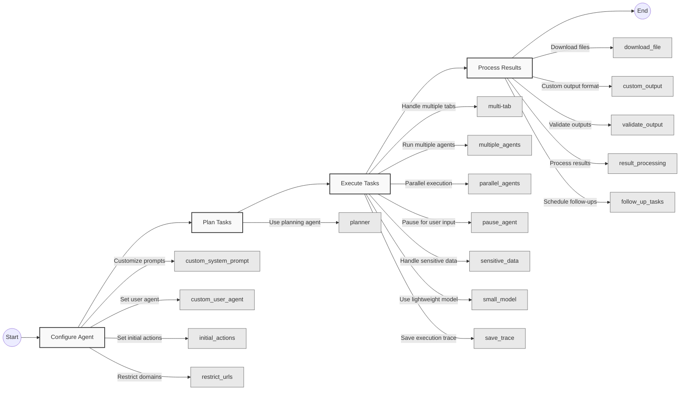

# Browser-Use Features

This directory contains example implementations of various features and capabilities of the Browser-Use framework. These examples demonstrate how to extend, customize, and optimize the framework for specific use cases.

## Feature Categories

The examples in this directory are organized into the following categories:



## File Relationships

```mermaid
flowchart TD
    %% Agent Configuration
    A[Agent Configuration] --> A1[custom_system_prompt.py]
    A --> A2[custom_user_agent.py]
    A --> A3[initial_actions.py]
    A --> A4[restrict_urls.py]
    
    %% Multi-Agent & Parallelism
    B[Multi-Agent & Parallelism] --> B1[multiple_agents_same_browser.py]
    B --> B2[parallel_agents.py]
    B --> B3[multi-tab_handling.py]
    
    %% Control Flow & Planning
    C[Control Flow & Planning] --> C1[pause_agent.py]
    C --> C2[planner.py]
    C --> C3[follow_up_tasks.py]
    
    %% IO & State Management
    D[IO & State Management] --> D1[custom_output.py]
    D --> D2[outsource_state.py]
    D --> D3[download_file.py]
    D --> D4[save_trace.py]
    
    %% Security & Validation
    E[Security & Validation] --> E1[sensitive_data.py]
    E --> E2[validate_output.py]
    
    %% Model Optimization
    F[Model Optimization] --> F1[small_model_for_extraction.py]
    
    %% Post-Processing
    G[Post-Processing] --> G1[result_processing.py]

    %% Relationships between features
    A1 -.-> A2
    B1 -.-> B2
    C1 -.-> C3
    D2 -.-> D4
    E1 -.-> E2
    C2 -.-> G1
    
    classDef category fill:#f9f9f9,stroke:#333,stroke-width:2px
    classDef file fill:#e9e9e9,stroke:#666,stroke-width:1px
    class A,B,C,D,E,F,G category
    class A1,A2,A3,A4,B1,B2,B3,C1,C2,C3,D1,D2,D3,D4,E1,E2,F1,G1 file
```



## Feature Usage Patterns

The following flowchart illustrates common usage patterns and how different features can be combined:



## Examples Overview

### Agent Configuration

- **custom_system_prompt.py**: Customize the system prompt for the agent
- **custom_user_agent.py**: Set a specific user agent for browser requests
- **initial_actions.py**: Configure predefined initial actions for the agent
- **restrict_urls.py**: Limit the agent to specific domains or URLs

### Multi-Agent & Parallelism

- **multiple_agents_same_browser.py**: Run multiple agents sharing the same browser context
- **parallel_agents.py**: Execute multiple agents in parallel
- **multi-tab_handling.py**: Manage operations across multiple browser tabs

### Control Flow & Planning

- **pause_agent.py**: Pause agent execution for user input or verification
- **planner.py**: Implement a planning agent for multi-step operations
- **follow_up_tasks.py**: Schedule and execute follow-up tasks

### IO & State Management

- **custom_output.py**: Customize the output format of agent results
- **outsource_state.py**: Manage and share state between agent sessions
- **download_file.py**: Handle file downloads during browser sessions
- **save_trace.py**: Record and save execution traces for debugging

### Security & Validation

- **sensitive_data.py**: Handle and secure sensitive information
- **validate_output.py**: Validate and sanitize agent outputs

### Model Optimization

- **small_model_for_extraction.py**: Use smaller models for DOM extraction to reduce costs

### Post-Processing

- **result_processing.py**: Process and transform agent results

## Usage Example

To use any of these features, import the corresponding module and integrate it with your agent setup:

```python
from browser_use import Agent
from langchain_openai import ChatOpenAI

# Import feature modules
from custom_system_prompt import get_custom_system_prompt
from download_file import setup_download_handler

async def main():
    # Configure agent with custom features
    agent = Agent(
        task="Search for a PDF and download it",
        llm=ChatOpenAI(model="gpt-4o"),
        system_prompt=get_custom_system_prompt(),
    )
    
    # Set up download handler
    await setup_download_handler(agent)
    
    # Run the agent
    result = await agent.run()
    print(result)

# Run the example
import asyncio
asyncio.run(main())
```

## Creating Your Own Features

You can extend Browser-Use with your own custom features by following these patterns:

1. Create a new Python file in your project
2. Import the necessary Browser-Use components
3. Implement your feature as a function or class
4. Integrate it with the Agent creation or execution flow

For more advanced customizations, refer to the [documentation](https://docs.browser-use.com). 